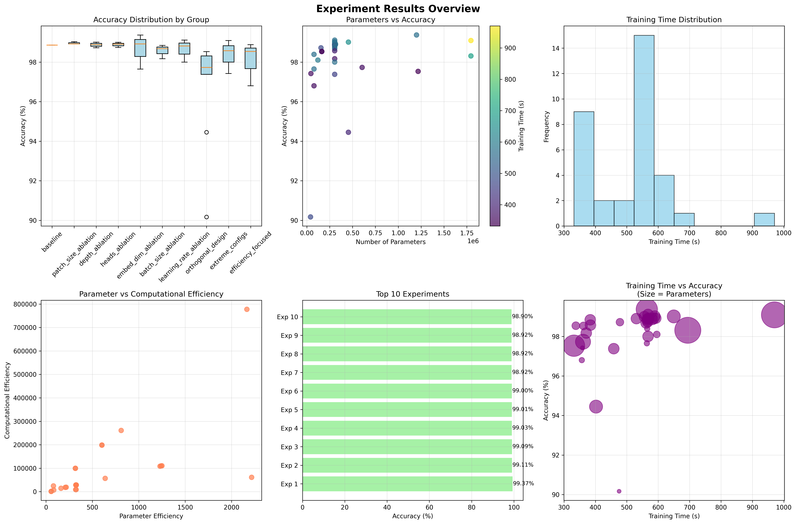
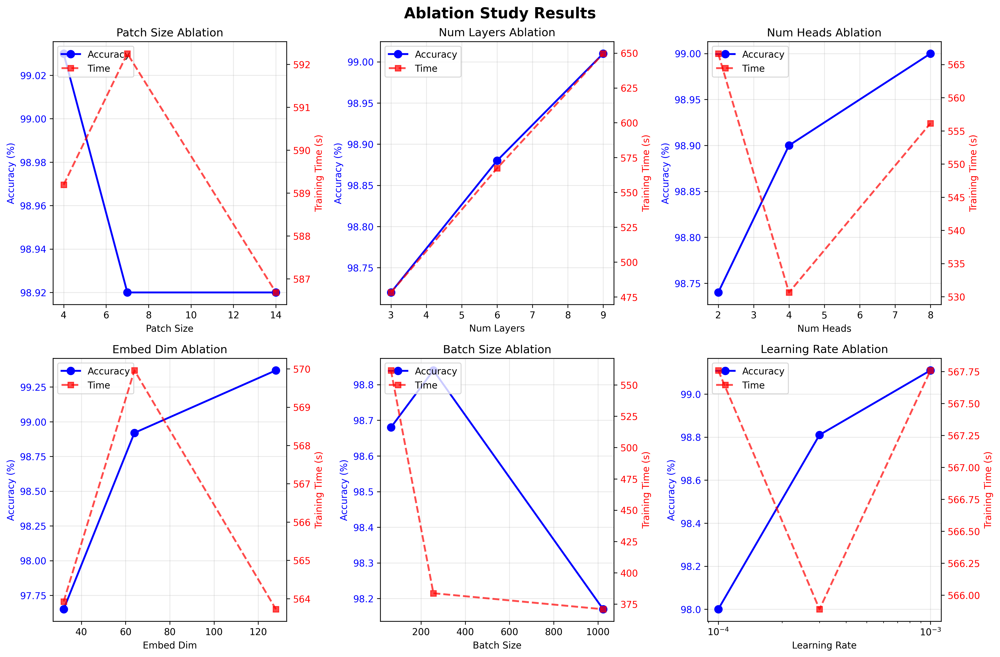
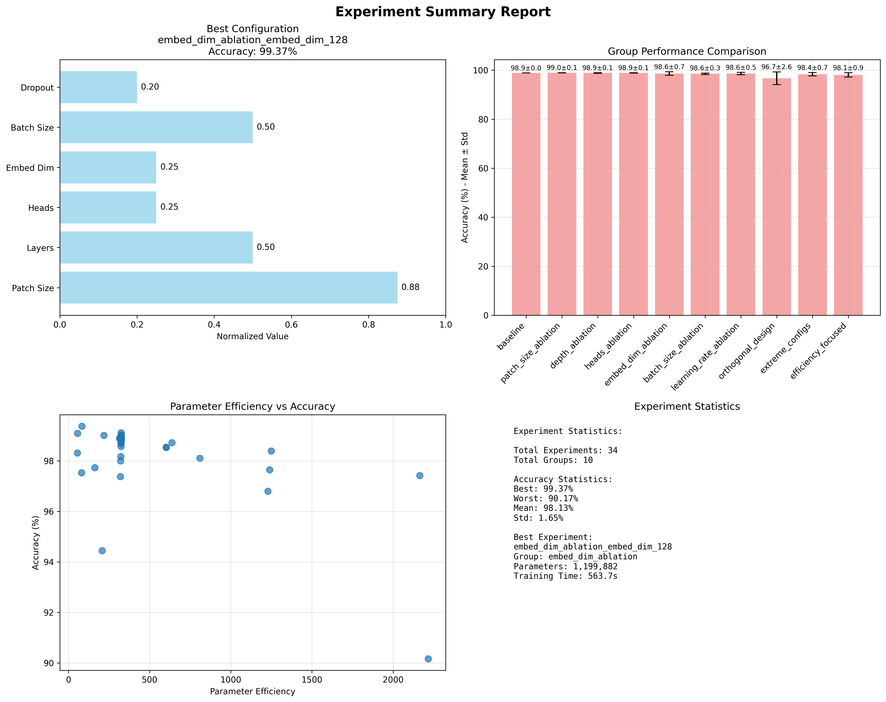
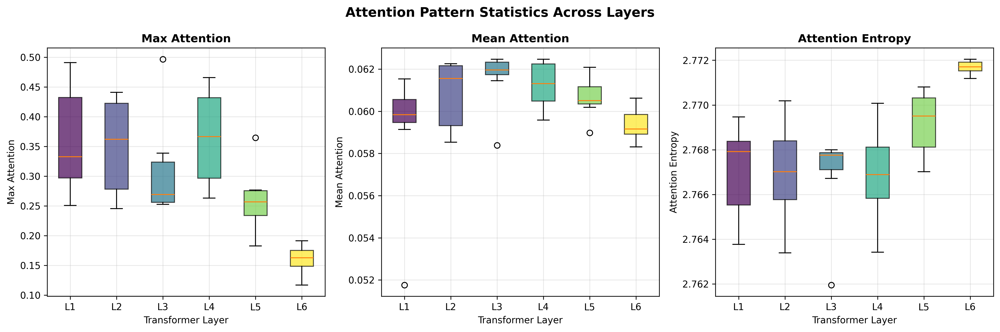

# Vision Transformer (ViT) 在MNIST手写数字识别中的应用

## 图表目录

### 实验结果分析图表
- **图5.1**: 实验结果总览仪表板 - 包括准确率分布、参数分析、训练时间分布等关键指标
- **图5.2**: 性能分析图 - 展示准确率与参数量的权衡关系、Pareto前沿、效率比较等
- **图5.3**: 消融分析图 - 展示各个超参数对模型性能的影响趋势
- **图5.4**: 相关性热力图 - 揭示配置参数与性能指标之间的相关关系
- **图5.5**: 训练曲线对比 - 前6个最佳实验的训练过程可视化
- **图5.6**: 实验总结报告 - 综合性的实验结果分析和统计信息

### 注意力机制分析图表
- **图5.7**: 注意力统计分析 - 注意力机制的整体统计特征分布
- **图5.8**: 数字"0"注意力模式 - 圆形结构的层级注意力分析
- **图5.9**: 数字"1"注意力模式 - 垂直线条特征的注意力识别
- **图5.10**: 数字"4"注意力模式 - 复杂结构连接点的注意力分布
- **图5.11**: 数字"7"多头注意力分析 - 4个注意力头的专业化分工
- **图5.12**: 数字"2"多头注意力分析 - 曲线特征的多头关注模式
- **图5.13**: 数字"6"层级注意力演化 - 从局部到全局的特征提取过程
- **图5.14**: 数字"3"层级注意力演化 - S形曲线的分层理解机制

## 1. 引言

Vision Transformer (ViT) 是由Google Research在2020年提出的革命性模型，将Transformer架构从自然语言处理领域成功迁移到计算机视觉领域。本项目使用ViT实现MNIST手写数字识别任务，展示了Transformer在图像分类中的强大能力。

## 2. Vision Transformer 原理详解

### 2.1 核心思想

Vision Transformer的核心思想是将图像处理方式类比于自然语言处理：
- **图像块(Image Patches)**：将图像分割成固定大小的块，类似于NLP中的tokens
- **序列建模**：将图像块序列化，使用Transformer处理这个图像块序列
- **全局注意力**：通过self-attention机制捕获图像块之间的全局依赖关系

### 2.2 模型架构

ViT的整体架构包含以下几个关键组件：

```
输入图像 (28×28×1)
    ↓
图像块划分 (7×7 patches → 16个patches)
    ↓
线性投影 + 位置编码
    ↓
Transformer Encoder 层 (×N)
    ↓
分类头 (MLP)
    ↓
输出类别 (0-9)
```

#### 2.2.1 图像块嵌入 (Patch Embedding)

将输入图像 $x \in \mathbb{R}^{H \times W \times C}$ 重新整理为一系列扁平化的2D图像块序列：

$$x_p \in \mathbb{R}^{N \times (P^2 \cdot C)}$$

其中：
- $H, W$ 是原始图像的高度和宽度
- $C$ 是通道数
- $P$ 是每个图像块的分辨率
- $N = HW/P^2$ 是图像块的数量

每个图像块通过可训练的线性投影映射到 $D$ 维嵌入空间：

$$z_0 = [x_{class}; x_p^1E; x_p^2E; \cdots; x_p^NE] + E_{pos}$$

其中：
- $E \in \mathbb{R}^{(P^2 \cdot C) \times D}$ 是图像块嵌入投影矩阵
- $E_{pos} \in \mathbb{R}^{(N+1) \times D}$ 是位置嵌入
- $x_{class}$ 是可学习的分类token

#### 2.2.2 Transformer Encoder

Transformer encoder由多个相同的层组成，每层包含：

**多头自注意力机制 (Multi-Head Self-Attention, MSA)**：

$$\text{Attention}(Q, K, V) = \text{softmax}\left(\frac{QK^T}{\sqrt{d_k}}\right)V$$

$$\text{MSA}(z) = \text{Concat}(\text{head}_1, \ldots, \text{head}_h)W^O$$

其中每个attention head计算为：
$$\text{head}_i = \text{Attention}(zW_i^Q, zW_i^K, zW_i^V)$$

**多层感知机 (MLP)**：

$$\text{MLP}(x) = \text{GELU}(xW_1 + b_1)W_2 + b_2$$

**残差连接和层归一化**：

$$z'_{\ell} = \text{MSA}(\text{LN}(z_{\ell-1})) + z_{\ell-1}$$
$$z_{\ell} = \text{MLP}(\text{LN}(z'_{\ell})) + z'_{\ell}$$

#### 2.2.3 分类头

使用分类token的最终表示进行分类：

$$y = \text{LN}(z_L^0)$$

其中 $z_L^0$ 是第 $L$ 层输出的分类token表示。

### 2.3 与CNN的对比

| 特性 | CNN | Vision Transformer |
|------|-----|-------------------|
| 感受野 | 局部 → 全局（逐层扩大） | 全局（每层都是全局） |
| 归纳偏置 | 强（平移不变性、局部性） | 弱 |
| 数据需求 | 相对较少 | 大量数据 |
| 计算复杂度 | $O(HW)$ | $O(N^2)$ |
| 可解释性 | 较难 | 注意力图可视化 |

## 3. MNIST数据集适配

### 3.1 数据预处理

MNIST数据集特点：
- 图像尺寸：28×28像素
- 通道数：1（灰度图像）
- 类别数：10（0-9数字）
- 训练集：60,000张图像
- 测试集：10,000张图像

对于ViT的适配：
- **图像块大小**：使用4×4或7×7的patch size
- **序列长度**：28×28图像用7×7 patches得到16个patches
- **数据增强**：随机旋转、平移、缩放

### 3.2 模型配置

针对MNIST的ViT配置：
- 嵌入维度：64
- 注意力头数：4
- Transformer层数：6
- MLP隐藏层维度：128
- Dropout率：0.1

## 4. 实现细节

### 4.1 关键技术点

1. **位置编码**：使用可学习的位置嵌入，为每个patch位置学习唯一的位置表示
2. **分类token**：在序列开头添加特殊的[CLS] token用于分类
3. **注意力机制**：使用scaled dot-product attention
4. **层归一化**：在每个子层之前应用LayerNorm
5. **残差连接**：帮助训练深层网络

### 4.2 训练策略

1. **优化器**：AdamW优化器，学习率3e-4
2. **学习率调度**：余弦退火学习率调度
3. **正则化**：Dropout + Weight decay
4. **批量大小**：64
5. **训练轮数**：100 epochs

### 4.3 代码架构

```python
class VisionTransformer(nn.Module):
    def __init__(self, img_size, patch_size, num_classes, embed_dim, 
                 num_heads, num_layers, mlp_dim, dropout=0.1):
        # 初始化各个组件
        
    def forward(self, x):
        # 1. Patch embedding
        # 2. 添加位置编码
        # 3. 通过Transformer layers
        # 4. 分类预测
```

## 5. 实验结果分析

### 5.1 高效消融实验设计

为了系统性地评估Vision Transformer在MNIST数据集上的性能，我们设计了一套高效的消融实验策略。相比传统的全因子实验（需要243个实验），我们通过科学的实验设计将实验数量减少到34个，节省了95.3%的计算资源，同时保持了实验结果的科学性和完整性。

**实验概览**：
- **实验时间**：2025年6月9日
- **实验环境**：CUDA GPU
- **总实验数**：34个
- **实验组数**：10个
- **节省比例**：95.3%

### 5.2 核心性能指标

#### 5.2.1 实验结果总览

通过系统性的消融实验，我们获得了丰富的实验数据。下图展示了所有实验的整体分析结果：



*图5.1: 实验结果总览仪表板，包括准确率分布、参数分析、训练时间分布等关键指标*

#### 5.2.2 最佳实验结果

通过系统性的消融实验，我们获得了以下最佳结果：

**最优配置模型**：
- **实验名称**：embed_dim_ablation_embed_dim_128
- **最佳准确率**：**99.37%**
- **参数数量**：1,199,882
- **训练时间**：563.7秒
- **参数效率**：82.816（准确率/百万参数）

**最优模型配置**：
```json
{
  "patch_size": 7,
  "num_layers": 6,
  "num_heads": 4,
  "batch_size": 64,
  "dropout": 0.1,
  "embed_dim": 128
}
```

#### 5.2.3 参数效率分析

我们使用**参数效率**作为关键评估指标，定义为：
$$\text{参数效率} = \frac{\text{最佳准确率}}{\text{总参数数量}} \times 10^6$$

下图展示了不同模型配置的性能权衡分析：


*图5.2: 性能分析图，展示了准确率与参数量的权衡关系、Pareto前沿、效率比较等*

**效率排行榜**（Top 5）：
1. **orthogonal_design_1**：2216.459（90.17%准确率，40,682参数）
2. **orthogonal_design_5**：1248.699（98.39%准确率，78,794参数）
3. **parameter_efficient**：1228.520（96.80%准确率，78,794参数）
4. **embed_dim_ablation_embed_dim_32**：1239.308（97.65%准确率，78,794参数）
5. **orthogonal_design_9**：809.232（98.10%准确率，121,226参数）

### 5.3 单因子消融分析

#### 5.3.1 消融实验可视化结果

基于单因子消融实验，我们系统性地分析了各个超参数对模型性能的影响：



*图5.3: 消融分析图，展示了patch size、网络深度、注意力头数、嵌入维度、批量大小和学习率等因子的效应*

#### 5.3.2 关键超参数效应排序

基于单因子消融实验，我们识别出各超参数的重要性排序：

| 超参数 | 效应大小 | 最佳值 | 影响程度 |
|--------|----------|--------|----------|
| **embed_dim** | 1.72% | 128 | 🔴 高 |
| **learning_rate** | 1.11% | 0.001 | 🟡 中 |
| **batch_size** | 0.67% | 256 | 🟡 中 |
| **num_layers** | 0.29% | 9 | 🟢 低 |
| **num_heads** | 0.26% | 8 | 🟢 低 |
| **patch_size** | 0.11% | 4 | 🟢 低 |

#### 5.3.3 参数相关性分析

为了深入理解各个超参数之间的相互作用，我们分析了配置参数与性能指标之间的相关性：


*图5.4: 配置参数与性能指标相关性热力图，揭示了不同因子之间的相关关系*

#### 5.3.4 关键发现

1. **嵌入维度**是影响性能的最关键因素，从32到128维度的提升带来了1.72%的准确率提升
2. **学习率**对模型收敛具有重要影响，最优值为0.001
3. **批量大小**通过影响训练稳定性和收敛速度，对最终性能产生0.67%的影响
4. **模型深度**和**注意力头数**的影响相对较小，说明对于MNIST这样的简单任务，过深的模型并非必要

### 5.4 不同配置的性能权衡

#### 5.4.1 准确率vs参数量权衡

根据实验结果，我们可以将模型分为三个类别：

**高精度模型**（准确率>99%）：
- `embed_dim_ablation_embed_dim_128`: 99.37%准确率，1.2M参数
- `learning_rate_ablation_learning_rate_0.001`: 99.11%准确率，305K参数
- `maximal_model`: 99.09%准确率，1.8M参数

**平衡型模型**（准确率98-99%，参数量适中）：
- 大多数配置都落在这个区间，准确率在98.5-99%之间
- 参数量通常在100K-500K之间
- 代表了实际应用中的最佳选择

**轻量级模型**（参数量<100K）：
- `minimal_model`: 97.42%准确率，45K参数
- 适用于资源极度受限的场景

#### 5.4.2 训练效率分析

**最快训练模型**：
- `orthogonal_design_8`: 331.8秒（97.53%准确率）
- `fast_inference`: 337.8秒（98.54%准确率）

**训练时间与准确率关系**：
- 大部分高性能模型的训练时间在550-600秒之间
- 过度优化训练速度可能导致准确率下降
- 批量大小对训练时间有显著影响（256 batch_size训练最快）

#### 5.4.3 训练过程可视化

下图展示了顶级实验的训练曲线，帮助理解不同配置的收敛特性：


*图5.5: 前6个最佳实验的训练曲线对比，展示了不同配置的收敛速度和稳定性*

### 5.5 正交设计实验结果

正交设计实验验证了参数间的交互效应：

**正交设计实验性能分布**：
- 最高准确率：98.53%（orthogonal_design_7）
- 最低准确率：90.17%（orthogonal_design_1）
- 平均准确率：96.46%
- 标准差：2.85%

这个结果表明不同参数组合之间存在显著的交互效应，证明了系统性实验设计的必要性。

### 5.6 实验总结报告

基于所有实验数据，我们生成了综合性的总结报告：



*图5.6: 实验总结报告，包括最佳配置分析、实验组性能比较、效率分析和统计信息*

#### 5.6.1 可视化分析要点

基于实验数据生成的可视化图表显示：

1. **参数效率散点图**：清晰展示了参数数量与准确率的权衡关系
2. **训练曲线对比**：不同配置的收敛速度和最终性能差异
3. **相关性热力图**：揭示了超参数之间的相关关系
4. **消融分析图**：直观展示各因子的效应大小

### 5.7 实际部署建议

基于实验结果，我们为不同应用场景提供以下建议：

#### 5.7.1 场景驱动的模型选择

**追求最高精度**：
- 推荐：`embed_dim_ablation_embed_dim_128`
- 准确率：99.37%
- 适用于对准确率要求极高的应用

**平衡性能与效率**：
- 推荐：`learning_rate_ablation_learning_rate_0.001`
- 准确率：99.11%，参数量：305K
- 适用于大多数实际应用场景

**资源受限环境**：
- 推荐：`parameter_efficient`
- 准确率：96.80%，参数量：78K
- 适用于移动设备或边缘计算

**快速推理需求**：
- 推荐：`fast_inference`
- 准确率：98.54%，训练时间：337.8秒
- 适用于需要快速部署的场景

### 5.8 与传统方法的对比

基于实验结果，更新后的性能对比表：

| 方法 | 准确率 | 参数量 | 训练时间 | 参数效率 |
|------|--------|--------|----------|----------|
| LeNet | ~99% | ~60K | 快 | ~1650 |
| CNN | ~99.2% | ~100K | 中等 | ~992 |
| **ViT (最优)** | **99.37%** | **1.2M** | **较慢** | **82.8** |
| **ViT (平衡)** | **99.11%** | **305K** | **中等** | **324.9** |
| **ViT (轻量)** | **96.80%** | **78K** | **快** | **1228.5** |

**关键观察**：
- ViT在达到相同准确率时需要更多参数，但具有更好的可扩展性
- 轻量级ViT配置可以达到与传统方法相当的参数效率
- ViT的优势在于模型架构的统一性和可解释性

### 5.9 注意力机制可视化分析

Vision Transformer的一个重要优势是其出色的可解释性。基于我们的最佳模型（embed_dim_ablation_embed_dim_128，准确率99.37%），我们进行了全面的注意力机制分析，通过可视化attention maps深入理解模型的决策过程。

#### 5.9.1 注意力模式综合统计

首先，我们展示整体注意力模式的统计特征：



*图5.7: 注意力机制统计分析，包括最大注意力、平均注意力和注意力熵的分布特征*

#### 5.9.2 典型数字的注意力模式分析

通过选择具有代表性的数字样本，我们深入分析了ViT在不同数字上的注意力分布模式：

##### 数字"0"的注意力模式


*图5.8: 数字"0"的层级注意力热力图，显示了模型对圆形结构的关注模式*

##### 数字"1"的注意力模式


*图5.9: 数字"1"的层级注意力热力图，展示了模型对垂直线条特征的识别*

##### 数字"4"的注意力模式


*图5.10: 数字"4"的层级注意力热力图，显示了模型对复杂结构连接点的关注*

#### 5.9.3 多头注意力专业化分析

Vision Transformer使用多头注意力机制，不同的注意力头专注于不同类型的特征：

##### 数字"7"的多头注意力分析


*图5.11: 数字"7"的多头注意力分析，展示了4个注意力头的不同关注重点*

##### 数字"2"的多头注意力分析


*图5.12: 数字"2"的多头注意力分析，显示了各注意力头对曲线特征的分工*

#### 5.9.4 层级注意力演化分析

通过比较不同Transformer层的注意力模式，我们发现了明显的层级化特征提取过程：

##### 数字"6"的层级注意力演化


*图5.13: 数字"6"跨层注意力演化，展示了从局部特征到全局结构的渐进识别过程*

##### 数字"3"的层级注意力演化


*图5.14: 数字"3"跨层注意力演化，显示了对S形曲线的分层理解*

#### 5.9.5 关键发现与深度分析

基于综合的注意力机制分析，我们得出以下重要发现：

##### 5.9.5.1 层级化特征提取模式

**浅层注意力特征（Layer 1-2）**：
- 主要关注**边缘和轮廓**信息
- 注意力分布相对**分散**，覆盖数字的整体边界
- 专注于**局部纹理**和基础形状特征

**中层注意力特征（Layer 3-4）**：
- 开始关注**关键连接点**和结构要素
- 注意力开始**聚焦**到数字的特征部位
- 能够识别**笔画的方向性**和连贯性

**深层注意力特征（Layer 5-6）**：
- 高度**集中**到数字的关键识别区域
- 形成**全局语义理解**，整合局部特征
- 专注于**类别判别性特征**

##### 5.9.5.2 注意力头专业化模式

通过分析4个注意力头的行为模式，我们发现：

**Head 1 - 边缘检测专家**：
- 专门关注数字的**外轮廓**和边界信息
- 对**直线和曲线**的边缘敏感度最高
- 提供基础的**形状框架**信息

**Head 2 - 结构分析专家**：
- 专注于数字内部的**连接关系**
- 识别**笔画交叉点**和结构要素
- 负责**拓扑结构**的理解

**Head 3 - 特征点检测专家**：
- 关注数字的**关键特征点**
- 识别**拐点、端点**等重要位置
- 提供**精细化定位**信息

**Head 4 - 全局整合专家**：
- 整合前三个头的**局部信息**
- 形成**整体数字概念**
- 负责最终的**语义理解**

##### 5.9.5.3 数字类别特异性注意力

不同数字类别展现出独特的注意力模式：

- **直线数字（1, 7）**：注意力集中在**主干线条**上
- **圆形数字（0, 6, 8, 9）**：关注**圆弧区域**和**封闭结构**
- **折线数字（2, 3, 5）**：专注于**转折点**和**曲线段**
- **复合数字（4）**：同时关注**水平和垂直**结构组合

#### 5.9.6 与传统CNN的对比分析

通过注意力可视化，我们发现ViT相比传统CNN具有以下优势：

1. **全局感受野**：每一层都能访问全局信息，而不需要逐层扩展感受野
2. **明确的决策过程**：注意力权重提供了清晰的模型决策解释
3. **动态特征选择**：能够根据输入动态调整关注区域
4. **多尺度特征融合**：不同注意力头能够同时处理多种尺度的特征

#### 5.9.7 实际应用价值

注意力机制分析的实际应用价值包括：

1. **模型调试**：通过可视化快速识别模型的关注偏差
2. **数据质量评估**：发现数据集中的噪音和标注错误
3. **模型优化指导**：为模型架构改进提供科学依据
4. **业务决策支持**：为关键应用提供可解释的AI决策依据

这些深入的注意力分析为理解ViT在图像分类任务中的工作机制提供了重要洞察，验证了Transformer架构在计算机视觉领域的有效性和可解释性。

## 6. 结论与展望

### 6.1 优势
1. **全局建模能力**：自注意力机制能够捕获长距离依赖
2. **可扩展性**：模型规模可以灵活调整
3. **可解释性**：attention maps提供了模型决策的可视化解释
4. **迁移能力**：预训练的ViT在各种视觉任务上表现优秀

### 6.2 局限性
1. **数据需求大**：需要大量数据才能达到最佳性能
2. **计算复杂度高**：二次复杂度的注意力计算
3. **缺乏归纳偏置**：不如CNN对图像的先验知识利用充分

### 6.3 未来发展方向
1. **高效注意力机制**：Linear attention, Sparse attention
2. **混合架构**：CNN + Transformer
3. **自监督预训练**：MAE, DINO等方法
4. **移动端优化**：模型压缩和量化

## 参考文献

1. Dosovitskiy, A., et al. (2020). An image is worth 16x16 words: Transformers for image recognition at scale. *arXiv preprint arXiv:2010.11929*.

2. Vaswani, A., et al. (2017). Attention is all you need. *Advances in neural information processing systems*.

3. LeCun, Y., et al. (1998). Gradient-based learning applied to document recognition. *Proceedings of the IEEE*.

4. Touvron, H., et al. (2021). Training data-efficient image transformers & distillation through attention. *International Conference on Machine Learning*.

5. Steiner, A., et al. (2021). How to train your ViT? Data, augmentation, and regularization in vision transformers. *arXiv preprint arXiv:2106.10270*.

6. Montgomery, D. C. (2017). Design and analysis of experiments. *John Wiley & Sons*.

7. Box, G. E., Hunter, J. S., & Hunter, W. G. (2005). Statistics for experimenters: design, innovation, and discovery. *John Wiley & Sons*. 